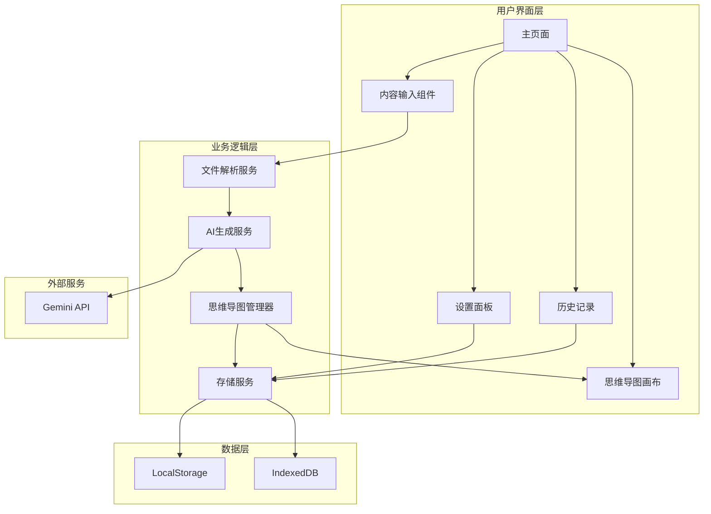

# 设计文档

## 概述

AI思维导图生成器是一个基于React的单页应用（SPA），使用Gemini 3.0 API将各种格式的内容智能转换为可视化思维导图。系统采用前端为主的架构，所有处理在浏览器中完成，数据存储在本地。

### 核心功能
- 多格式内容输入（文本、PDF、Word、Markdown）
- AI驱动的思维导图结构生成
- 交互式思维导图编辑器
- 多格式导出（PNG、JSON、Markdown）
- 本地数据持久化

### 技术栈
- **前端框架**: React 18 + TypeScript
- **思维导图渲染**: ReactFlow（灵活的节点图库）
- **AI集成**: @google/generative-ai（Gemini API SDK）
- **文档解析**: 
  - PDF: pdfjs-dist
  - Word: mammoth
  - Markdown: marked
- **状态管理**: Zustand（轻量级状态管理）
- **样式**: Tailwind CSS
- **构建工具**: Vite

## 架构

### 系统架构图



### 数据流

1. **内容输入流程**:
   - 用户上传文件或粘贴文本 → 文件解析服务提取文本 → 存储到临时状态

2. **AI生成流程**:
   - 用户触发生成 → 验证API密钥 → 调用Gemini API → 解析响应 → 构建思维导图数据结构 → 渲染到画布

3. **编辑流程**:
   - 用户交互（点击、拖拽、编辑） → 更新思维导图状态 → 重新渲染画布

4. **保存流程**:
   - 用户保存 → 序列化思维导图数据 → 存储到LocalStorage/IndexedDB → 更新历史记录列表


## 组件和接口

### 前端组件结构

```
src/
├── components/
│   ├── Layout/
│   │   ├── Header.tsx              # 顶部导航栏
│   │   ├── Sidebar.tsx             # 侧边栏（历史记录）
│   │   └── Footer.tsx              # 底部信息栏
│   ├── Input/
│   │   ├── FileUploader.tsx        # 文件上传组件
│   │   ├── TextInput.tsx           # 文本输入框
│   │   └── QuickGenerate.tsx       # 一键生成对话框
│   ├── MindMap/
│   │   ├── Canvas.tsx              # 思维导图画布（ReactFlow）
│   │   ├── Node.tsx                # 自定义节点组件
│   │   ├── Edge.tsx                # 自定义连线组件
│   │   ├── Controls.tsx            # 画布控制按钮
│   │   └── ContextMenu.tsx         # 右键菜单
│   ├── Settings/
│   │   ├── ApiKeyConfig.tsx        # API密钥配置
│   │   └── SettingsPanel.tsx       # 设置面板
│   ├── Export/
│   │   └── ExportMenu.tsx          # 导出选项菜单
│   └── Common/
│       ├── Button.tsx              # 通用按钮
│       ├── Modal.tsx               # 模态对话框
│       ├── Loading.tsx             # 加载动画
│       └── Toast.tsx               # 提示消息
├── services/
│   ├── fileParser.ts               # 文件解析服务
│   ├── geminiService.ts            # Gemini API服务
│   ├── mindmapService.ts           # 思维导图业务逻辑
│   ├── storageService.ts           # 本地存储服务
│   └── exportService.ts            # 导出服务
├── stores/
│   ├── mindmapStore.ts             # 思维导图状态
│   ├── settingsStore.ts            # 设置状态
│   └── historyStore.ts             # 历史记录状态
├── types/
│   ├── mindmap.ts                  # 思维导图类型定义
│   ├── api.ts                      # API类型定义
│   └── storage.ts                  # 存储类型定义
└── utils/
    ├── crypto.ts                   # 加密工具
    ├── validation.ts               # 验证工具
    └── format.ts                   # 格式化工具
```

### 核心接口定义

#### 思维导图数据结构

```typescript
interface MindMapNode {
  id: string;
  content: string;
  level: number;
  parentId: string | null;
  children: string[];
  position?: { x: number; y: number };
  style?: NodeStyle;
  collapsed?: boolean;
}

interface NodeStyle {
  backgroundColor?: string;
  borderColor?: string;
  textColor?: string;
  fontSize?: number;
}

interface MindMapData {
  id: string;
  title: string;
  nodes: MindMapNode[];
  createdAt: number;
  updatedAt: number;
  metadata?: {
    sourceType?: string;
    sourceFileName?: string;
  };
}
```

#### 文件解析服务接口

```typescript
interface FileParserService {
  parsePDF(file: File): Promise<string>;
  parseWord(file: File): Promise<string>;
  parseMarkdown(file: File): Promise<string>;
  parseText(file: File): Promise<string>;
  detectFileType(file: File): string;
}
```

#### Gemini服务接口

```typescript
interface GeminiService {
  generateMindMap(content: string, apiKey: string): Promise<MindMapStructure>;
  validateApiKey(apiKey: string): Promise<boolean>;
  generateFromTopic(topic: string, apiKey: string): Promise<MindMapStructure>;
}

interface MindMapStructure {
  title: string;
  nodes: Array<{
    content: string;
    level: number;
    children?: MindMapStructure['nodes'];
  }>;
}
```

#### 存储服务接口

```typescript
interface StorageService {
  saveApiKey(key: string): Promise<void>;
  getApiKey(): Promise<string | null>;
  deleteApiKey(): Promise<void>;
  saveMindMap(data: MindMapData): Promise<void>;
  getMindMap(id: string): Promise<MindMapData | null>;
  getAllMindMaps(): Promise<MindMapData[]>;
  deleteMindMap(id: string): Promise<void>;
}
```

#### 导出服务接口

```typescript
interface ExportService {
  exportToPNG(canvas: HTMLElement, filename: string): Promise<void>;
  exportToJSON(data: MindMapData, filename: string): Promise<void>;
  exportToMarkdown(data: MindMapData, filename: string): Promise<void>;
}
```


## 数据模型

### 状态管理模型

#### MindMap Store

```typescript
interface MindMapStore {
  currentMindMap: MindMapData | null;
  isLoading: boolean;
  error: string | null;
  setMindMap: (data: MindMapData) => void;
  updateNode: (nodeId: string, updates: Partial<MindMapNode>) => void;
  addNode: (parentId: string, content: string) => void;
  deleteNode: (nodeId: string) => void;
  moveNode: (nodeId: string, newParentId: string) => void;
  toggleNodeCollapse: (nodeId: string) => void;
  clear: () => void;
}
```

#### Settings Store

```typescript
interface SettingsStore {
  apiKey: string | null;
  theme: 'light' | 'dark';
  language: 'zh-CN';
  setApiKey: (key: string) => void;
  clearApiKey: () => void;
  setTheme: (theme: 'light' | 'dark') => void;
  loadSettings: () => Promise<void>;
}
```

#### History Store

```typescript
interface HistoryStore {
  mindMaps: MindMapData[];
  isLoading: boolean;
  loadHistory: () => Promise<void>;
  addToHistory: (data: MindMapData) => Promise<void>;
  removeFromHistory: (id: string) => Promise<void>;
  clearHistory: () => Promise<void>;
}
```

### 本地存储模型

```typescript
const STORAGE_KEYS = {
  API_KEY: 'mindmap_api_key_encrypted',
  SETTINGS: 'mindmap_settings',
  CURRENT_MAP: 'mindmap_current',
};

// IndexedDB: MindMapDB v1
interface MindMapRecord {
  id: string;
  data: MindMapData;
  createdAt: number;
  updatedAt: number;
}
```


## 正确性属性

*属性是系统在所有有效执行中应保持为真的特征或行为——本质上是关于系统应该做什么的形式化陈述。属性充当人类可读规范和机器可验证正确性保证之间的桥梁。*

### 属性 1: 文件解析保持内容完整性

*对于任意*有效的文本文件（PDF、Word、Markdown、TXT），解析后提取的文本内容应与原始文件中的文本内容一致。
**验证需求: 1.2, 1.3, 1.4, 1.5**

### 属性 2: API密钥存储往返一致性

*对于任意*有效的API密钥字符串，加密存储后再读取应得到相同的原始密钥值。
**验证需求: 2.2**

### 属性 3: API密钥掩码格式正确性

*对于任意*已保存的API密钥，显示的掩码版本应保留前缀和后缀，中间部分用星号替换。
**验证需求: 2.4**

### 属性 4: API密钥删除完整性

*对于任意*已保存的API密钥，删除操作后从存储中查询应返回null。
**验证需求: 2.5**

### 属性 5: Gemini API请求格式正确性

*对于任意*内容输入和有效API密钥，生成的API请求应包含内容字段和结构化提示词。
**验证需求: 3.2**

### 属性 6: AI响应解析有效性

*对于任意*Gemini API返回的结构化响应，解析后的思维导图数据应包含有效的标题和节点列表。
**验证需求: 3.3**

### 属性 7: 思维导图渲染完整性

*对于任意*思维导图数据，渲染到画布后所有节点都应可见且可访问。
**验证需求: 4.1**

### 属性 8: 节点点击高亮一致性

*对于任意*思维导图节点，点击后该节点应处于高亮状态。
**验证需求: 4.2**

### 属性 9: 视图缩放状态保持

*对于任意*缩放操作，执行后视图的缩放级别应相应改变。
**验证需求: 4.4**

### 属性 10: 节点折叠状态切换

*对于任意*具有子节点的节点，点击折叠/展开按钮应切换子节点的可见性状态。
**验证需求: 4.5**

### 属性 11: 节点编辑保存一致性

*对于任意*节点，编辑文本并保存后，节点内容应更新为新的文本值。
**验证需求: 5.2**

### 属性 12: 添加子节点增加节点数

*对于任意*节点，添加子节点后思维导图的总节点数应增加1，且新节点的父节点ID应指向当前节点。
**验证需求: 5.4**

### 属性 13: 删除节点移除子树

*对于任意*节点，删除该节点后，该节点及其所有子孙节点都应从思维导图中移除。
**验证需求: 5.5**

### 属性 14: 节点移动更新父子关系

*对于任意*两个节点A和B，将A拖拽到B下后，A的父节点ID应更新为B的ID，且B的子节点列表应包含A。
**验证需求: 5.6**

### 属性 15: JSON导出往返一致性

*对于任意*思维导图数据，导出为JSON后再导入应得到等价的思维导图结构。
**验证需求: 6.3**

### 属性 16: Markdown导出格式正确性

*对于任意*思维导图数据，导出的Markdown文本应使用正确的层级缩进表示节点关系。
**验证需求: 6.4**

### 属性 17: 思维导图保存往返一致性

*对于任意*思维导图数据，保存到本地存储后再加载应得到相同的数据结构。
**验证需求: 7.1, 7.3**

### 属性 18: 历史记录列表完整性

*对于任意*时刻，历史记录列表应包含所有已保存且未删除的思维导图。
**验证需求: 7.2**

### 属性 19: 历史记录删除一致性

*对于任意*历史记录项，删除后该项不应出现在历史记录列表中，且从存储中查询应返回null。
**验证需求: 7.4**

### 属性 20: 日期格式化中文正确性

*对于任意*时间戳，格式化后的日期字符串应符合中文日期格式（如：2024年1月1日）。
**验证需求: 8.5**

### 属性 21: 主题生成结构有效性

*对于任意*主题文本，使用Gemini API生成的思维导图应包含至少一个根节点。
**验证需求: 9.3**

### 属性 22: 文本输入接受一致性

*对于任意*非空文本输入，系统应接受该文本并将其保存到处理队列。
**验证需求: 1.6, 9.2**


## 错误处理

### 错误类型

1. **文件解析错误**
   - PDF损坏或加密
   - Word文档格式不支持
   - 文件大小超限

2. **API错误**
   - API密钥无效
   - 请求超时
   - 配额超限
   - 网络连接失败

3. **存储错误**
   - LocalStorage空间不足
   - IndexedDB访问被拒绝
   - 数据序列化失败

4. **渲染错误**
   - 节点数据格式无效
   - 画布初始化失败

### 错误处理策略

```typescript
interface ErrorHandler {
  handleFileParseError(error: Error, fileName: string): void;
  handleApiError(error: ApiError): void;
  handleStorageError(error: StorageError): void;
  handleRenderError(error: Error): void;
}

class ErrorRecovery {
  async retryWithBackoff<T>(fn: () => Promise<T>, maxRetries: number = 3): Promise<T>;
  fallbackToMemoryStorage(): void;
  getUserFriendlyMessage(error: Error): string;
}
```

## 测试策略

### 单元测试

使用 **Vitest** 作为测试框架，对以下模块进行单元测试：

1. **文件解析服务测试**
   - 测试各种文件格式的解析
   - 测试文件类型检测
   - 测试错误文件处理

2. **Gemini服务测试**
   - 模拟API响应测试
   - 测试请求格式构建
   - 测试响应解析逻辑

3. **存储服务测试**
   - 测试LocalStorage读写
   - 测试IndexedDB操作
   - 测试加密/解密功能

4. **思维导图服务测试**
   - 测试节点操作（增删改查）
   - 测试数据结构转换
   - 测试导出功能

5. **工具函数测试**
   - 测试加密工具
   - 测试验证工具
   - 测试格式化工具

### 属性测试

使用 **fast-check** 库进行属性测试，验证系统的正确性属性：

**配置要求**:
- 每个属性测试至少运行100次迭代
- 使用智能生成器约束输入空间

**测试标注格式**:
每个属性测试必须使用以下格式标注：
```typescript
// **Feature: ai-mindmap-generator, Property 1: 文件解析保持内容完整性**
```

**属性测试列表**:

1. **属性 1: 文件解析保持内容完整性**
   - 生成随机文本内容
   - 创建各种格式的文件
   - 验证解析后内容一致

2. **属性 2: API密钥存储往返一致性**
   - 生成随机API密钥
   - 加密存储后读取
   - 验证往返一致性

3. **属性 15: JSON导出往返一致性**
   - 生成随机思维导图数据
   - 导出为JSON后导入
   - 验证数据结构等价

4. **属性 17: 思维导图保存往返一致性**
   - 生成随机思维导图
   - 保存到存储后加载
   - 验证数据完整性

5. **属性 12: 添加子节点增加节点数**
   - 生成随机思维导图
   - 添加子节点
   - 验证节点数和父子关系

6. **属性 13: 删除节点移除子树**
   - 生成随机思维导图树
   - 删除节点
   - 验证节点及子树被移除

### 集成测试

使用 **Playwright** 进行端到端测试：

1. **完整工作流测试**
   - 上传文件 → 生成思维导图 → 编辑 → 保存 → 导出

2. **API集成测试**
   - 配置API密钥
   - 调用Gemini API
   - 验证生成结果

3. **UI交互测试**
   - 测试画布操作（缩放、拖拽）
   - 测试节点编辑
   - 测试菜单交互

### 测试覆盖率目标

- 核心业务逻辑: 90%+
- 服务层: 85%+
- 工具函数: 95%+
- UI组件: 70%+


## 性能优化

### 渲染优化

1. **虚拟化渲染**
   - 大型思维导图（>100节点）使用视口裁剪
   - 只渲染可见区域的节点

2. **节点懒加载**
   - 折叠的子树不渲染
   - 展开时动态加载

3. **防抖和节流**
   - 拖拽操作使用requestAnimationFrame
   - 搜索输入使用防抖（300ms）

### 数据优化

1. **增量更新**
   - 只更新变化的节点
   - 使用Zustand的选择器避免不必要的重渲染

2. **数据分页**
   - 历史记录分页加载（每页20条）
   - 大文件分块解析

### 缓存策略

1. **内存缓存**
   - 缓存解析后的文件内容
   - 缓存API响应（5分钟）

2. **持久化缓存**
   - 使用IndexedDB缓存大型思维导图
   - 使用LocalStorage缓存设置和小数据

## 安全考虑

### 数据安全

1. **API密钥加密**
   - 使用Web Crypto API加密存储
   - 密钥派生使用PBKDF2

2. **输入验证**
   - 文件大小限制（最大50MB）
   - 文件类型白名单验证
   - XSS防护（内容转义）

3. **数据隔离**
   - 使用唯一的存储键前缀
   - 避免跨域数据泄露

### API安全

1. **密钥保护**
   - 不在日志中记录API密钥
   - 不在错误消息中暴露密钥

2. **请求限制**
   - 实现请求频率限制
   - 防止API滥用

## 部署方案

### 构建配置

```typescript
// vite.config.ts
export default defineConfig({
  build: {
    target: 'es2020',
    outDir: 'dist',
    sourcemap: false,
    minify: 'terser',
    rollupOptions: {
      output: {
        manualChunks: {
          'react-vendor': ['react', 'react-dom'],
          'reactflow': ['reactflow'],
          'gemini': ['@google/generative-ai'],
        },
      },
    },
  },
});
```

### 静态托管

推荐部署平台：
- **Vercel**: 零配置部署，自动HTTPS
- **Netlify**: 持续部署，表单处理
- **GitHub Pages**: 免费托管，适合开源项目

### 环境变量

不需要后端环境变量，所有配置在客户端：
- API密钥由用户在设置中配置
- 无需服务器端配置

## 未来扩展

### 可能的功能增强

1. **协作功能**
   - 实时多人编辑
   - 评论和批注

2. **更多AI功能**
   - AI优化思维导图结构
   - AI生成节点内容建议

3. **高级导出**
   - 导出为PDF
   - 导出为PPT
   - 导出为SVG

4. **模板系统**
   - 预设思维导图模板
   - 自定义模板保存

5. **云同步**
   - 可选的云存储集成
   - 跨设备同步
